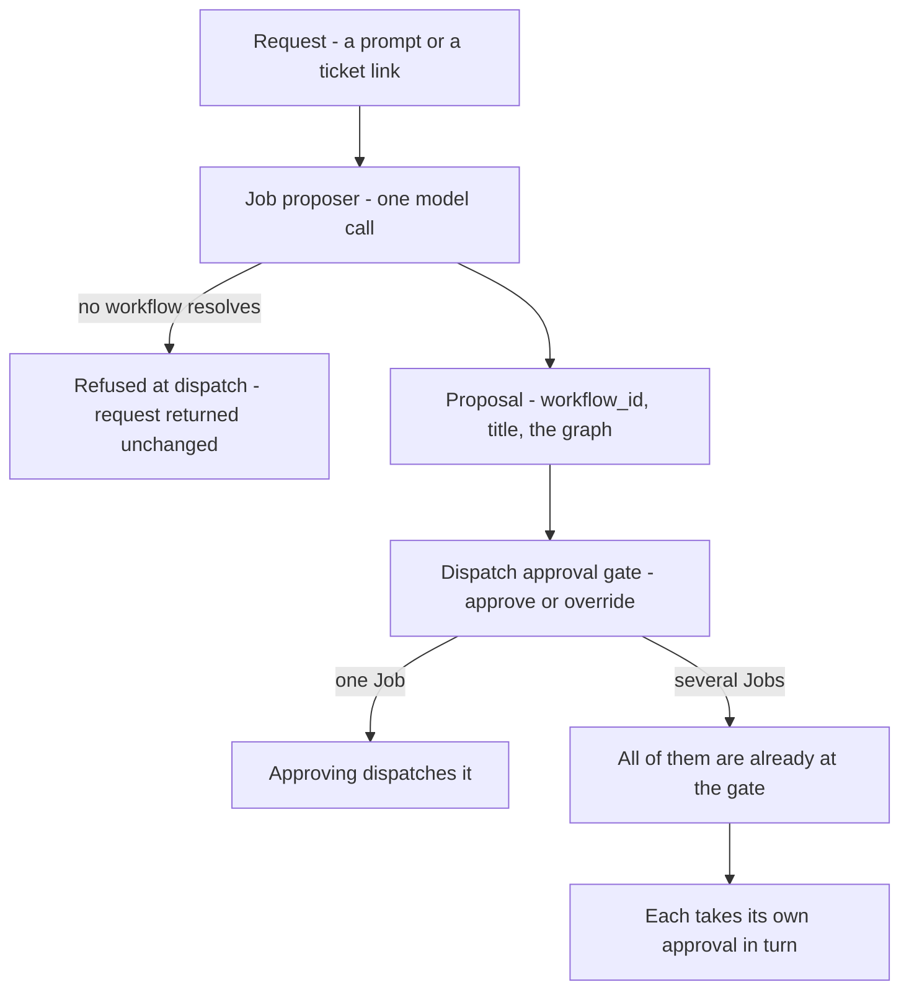

# Job proposer

**What it is:** The model call that reads a dispatch request — a prompt, a ticket link — and proposes a Job: which workflow it should run, what to call it, and where the work is several Jobs, the order between them. Proposes only; a person approves at the dispatch gate.

---

**Kind:** Policy.

Formalises the Job proposer. Its rules previously lived across [Manifest](manifest.md), [Workflow](workflow.md), [Fleet](fleet.md), [Job](job.md) and [Job Board](job-board.md); this document is their home and those pages link here.

**A Policy gets a document when it needs a name and a single owner, not an ID** — the same reason [Judge](judge.md) has one while being a Policy rather than a domain object.

## What it is

One model call on the dispatch path. It reads the request a person dispatched — a prompt, or a link to a ticket — and **proposes a Job**.

**It is a Policy rather than an Agent** — no toolset, no worktree, no session, no ability to transition anything. See `../contracts/system-architecture.md`. [Fleet](fleet.md) makes the call, reads the proposal and puts it in front of a person.

**It is a cheap model call with a bounded question, and a proposal a person approves or overrides.** It is not a session, an agent or a [Drone](drone.md); it is not a decision, and it dispatches nothing and transitions nothing.

**It is called the Job proposer, always.** The classifier, the Job-shape classifier and the shape classifier are retired — see `../contracts/design-system.md` lexicon.

## Why it exists

**So that dispatching is describing the work, not filling in a form.** A request arrives as a prompt or a ticket link. Someone has to decide what kind of work it is, which workflow fits, and whether it is one Job or several.

Doing that by hand means knowing the workflow catalogue before you can ask for anything.

> **Rule.** There is no hand-entry form. Describing the work is the only way a person makes a Job from Bridge, and a decision the proposer would take is overridden on the dispatch card's own Settings block — the workflow among them.
> Why: the owner, 23 September 2026 — *"I think with all of the settings, this is really not needed anymore."* This reverses the earlier reading that hand entry stays as the override. The form carried a title, a brief, a workflow, a model, an urgency and a land-as-one switch, and every decision in it but the title and the brief is now a field beside the request — which the proposer writes for you.

**30 September 2026: the last clause is narrower than it reads, and the rule above is unchanged.** *Which the proposer writes for you* named three settings. Two of them it does write — the model and the urgency, which is what 19.1 built. **Land-as-one it does not, and that is a decision rather than a gap**: how the work lands follows from having read the code, and this call has read none. The 3 September 2026 ruling is in `crates/fleet/src/proposal.rs`'s own header, which records that four documents were corrected against that module rather than the other way round; put beside the model on 30 September, the owner kept it. *Scope is not among them*, below, is the same argument for `write_targets`.

**What that costs is one field.** Land-as-one is still on the dispatch card and still a person's to set, so the rule above — every decision overridden on the Settings block — holds exactly as written. What a person does not get is a proposed value to react to for that one field.

## What it proposes

| Output | Detail |
| --- | --- |
| `workflow_id` | Which WorkflowDef the work should run under |
| `title` | What the Job is called, written from the description or the prompt |
| `acceptance_criteria` | What the Job is held to, one line each, where the request says |
| `urgency` | `incident` where something is broken for people right now; `normal` otherwise |
| `model` | Which model a Drone on this Job is spawned as, picked from what this machine holds. Absent is configuration deciding |
| A graph, where the work is several Jobs | The order they must land in |
| `facts`, where the work is several Jobs | What each one is for, and none of what the others are |

**The first four are in the owner's order and it is not a layout** (30 Sep 2026): the workflow decides the Job's shape, the title is what makes the row recognisable, done-when is the goal, and the settings are the part he can still change. The answer format asks for them in that order because a person watches the answer arrive and each line fills a place on their screen as it lands — `crates/fleet/src/proposing.rs`, `ANSWER_FORMAT`.

**The settings it answers are the urgency and the model**, and both arrive on one line of the answer — so they settle together and the fourth field is one field. **Land-as-one is not among them**, on the 3 September ruling above. What a proposal reaches the gate with is still a person's to change.

**The model is picked from a list, never invented.** The question carries every model `list_models` serves and the answer names one of them; a name this machine does not hold refuses the request, which comes back unchanged. **Naming none is configuration deciding** — the value `model` has always had when absent — and never a model this call picked as a default.

**It is refused for a workflow's reason and not through a workflow's words.** `fleet.proposer_model_not_held` is its own code, naming the model asked for and the models this machine runs. Collapsing it into *no workflow fits* told a person to rephrase a request that had been read correctly, which cannot change which models a machine runs — the rule in [When it cannot resolve a workflow](#when-it-cannot-resolve-a-workflow)'s neighbourhood, and `#334` and `#410`'s: two causes wanting opposite responses must not share a word.

**Naming the Job is part of the same reading**, so nobody types a title for work they have already described — the call has the description in front of it and a [Job](job.md) requires a name.

### A Job is briefed on its own part

**One Job's `facts` is the request as the person wrote it.** Nothing was divided, so its part is all of it.

**A member of a split gets its own `facts` and nothing else.** Not the rest of the request, and not the other Jobs' titles. What that line says is the whole of what its [Drone](drone.md) is told, which is why a plan of several whose member names no part is refused rather than handed the undivided request.

**The word is `facts` and not `scope`, and that is the contract's ruling rather than a preference.** [Design system](../contracts/design-system.md)'s retired-names table says a page "saying it proposes scope is describing a different call from the one that exists" — the proposer stopped naming scope when scope became a step's declared paths, and this page went on calling a member's own `facts` by the old word. Nothing on the wire ever carried it: `crates/ipc/src/proposing.rs` has no such field.

Why: a request naming a bug and an addition became two Jobs on 9 Sep 2026, and the first one did both. Every member carried the whole request, so the split lived in the two titles and nowhere a Drone reads — and the second Job was queued to redo work that had already landed.

What it costs is real and is the same cost in every direction: a Drone on a split no longer reads the sentences that were another Job's, including the body of any link the request named. The proposer read them, and writing each part is what it read them for.

[Workflow](workflow.md) owns the workflow catalogue. The resolved definition is frozen into the Job at creation, so the proposer chooses which one and the freeze is what stops it moving afterwards. A graph is proposed in one pass, and each member waits on the one before it reaching `completed_success`.

**One call, because it is one reading.** Which workflow, what to call it and whether it is one Job or several answer the same question — *what is this work* — off the same input.

### Scope is not among them

**It proposes no `write_targets`.** A Job it drafted reaches the gate with that field null.

Why: naming paths credibly needs the repository, and a guess would be a second source for something a [Drone](drone.md) states later with better information.

**The workflow's declaring step does not fill it in either.** `declare_scope` sets that step's own `DeclaredPaths`, which is what the drift check reads; `write_targets` moves only on a scope revision. [Change a Job's scope](../journeys/change-a-jobs-scope.md) holds what each of the two lists is for.

**How the work lands is not among them either.** Whether it is one pull request or several landing in order follows from what somebody has read, and this call has read no code — see [Landing](landing.md). The order between several Jobs is the one thing here it does propose, and an order is not a landing rule.

### A sibling may land the work first

**Two Jobs from one reading are unordered by construction.** A split is not a sequence, so the proposer writes no edge between them and [Fleet](fleet.md) never weighs one against the other — either may reach a Drone first, and either may land work the other was also asked for.

On 9 Sep 2026 one did. A request naming a bug and an addition became two Jobs; the first landed both and merged; the second was dispatched ninety seconds later into a base that already held its work. Its Drone found nothing to write and said so, and the [Judge](judge.md) — which reads the diff and never the transcript — refused it for not implementing a feature that was by then on `main`.

**So Fleet reads once before dispatching a queued Job whose sibling has landed.** It is shown that Job's brief and what the landed sibling's own Evidence claimed, and it answers whether anything asked for is still left to do. A Job with nothing left reaches `superseded` — *the work landed outside the Job; the record has nothing left to say* — and never takes a slot.

**The reading is Fleet's own and a Drone may not supply it.** `crates/fleet/src/gate.rs` holds the rule and why: a Drone reporting that its own work is unnecessary is prose, and reading prose catches an honest Drone and believes a dishonest one. This asks before a Drone exists, which is the only place the question can be answered by something with nothing at stake.

**A sibling that lands once a Drone is already working does not close the Job.** Its earlier steps wrote commits, and those are not only the part the sibling duplicated — closing it would throw away work nobody has read, and killing it mid-step is a different decision again. So the next step boundary carries what landed into the fresh Drone's opening brief, quoting the sibling's own Evidence, and the Drone decides. That block gates nothing: no Check reads it and no Judge sees it, which is what makes telling safe where `crates/fleet/src/gate.rs`'s rule makes believing unsafe.

**Every failure runs the Job.** An unreadable answer, a call that could not be made, a sibling that submitted no evidence — each answers *needed*. Of the two answers only *supersede it* cannot be taken back: a Job wrongly run repeats work and is caught at review; a Job wrongly superseded is work nobody notices is missing.

`proposal_id` is what makes a sibling findable, and it is the only thing on the record that says two Jobs are the same request.

### When it cannot resolve a workflow

**The request is refused at dispatch and returned unchanged.** No workflow is assigned by default. What the person gets back is the request they wrote, to retry or to hand-enter.

Why: the resolved definition is frozen into the Job at creation and becomes the yardstick the work is judged against, so a default would not be a guess the person could correct later — it would be the standard the Drone is held to.

## What it reads

| Given | Detail |
| --- | --- |
| The request | Verbatim. Fleet opens no link and fetches nothing |
| The workflows this Manifest holds | Each one's id, name and step labels, and what requests it is for where the definition declares `for_requests` |

**It is given nothing else.** Not the repository, not the `armada.yml`, not the Board, not the Jobs already running.

Why: every extra token is money on a call that fires on every dispatch, and a call that can reach the repository is a [Drone](drone.md) under another name.

**Step labels are how one workflow is told from another.** A name alone separates Bug from Revert and does not separate Feature from Refactor.

**`for_requests` is how a request is matched to a workflow at all.** Labels are in the workflow's own vocabulary, so they cannot say whether a request is this kind of work: nothing in Epic's `Plan the wave` is a word somebody asking to finish a milestone uses. The line is written in a requester's words, rendered beside the labels rather than instead of them, and optional — a definition declaring none is shown by its id, name and labels alone. `crates/core-model/domain/workflowdef-fields.toml` holds the field.

**Every workflow Armada ships declares one, read off its own Judge criteria.** Decided 1 Oct 2026, after a request to retire a guide was proposed as Refactor and Refactor's Judge refused the plan for changing what a person sees. The labels had not said that a refactor promises no visible change; the line now does, and each line names what separates it from its nearest neighbour. Fleet's `tests::proposing` refuses a shipped definition without one.

## It runs on every dispatch

**One dispatch path, not two.** The call runs whether the repository holds one Workspace or several, so there is no case in which a person types the workflow instead of approving one.

Skipping it where the answer looks obvious would cost the Job its entry zero, which is what a revert inherits and a rescope recomputes against.

**Cost accepted:** a cheap model call, its latency and its budget, on every dispatch.

## Where the proposal is approved

| Step | What happens |
| --- | --- |
| 1 | A person opens Dispatch a Job |
| 2 | They describe the work — typed, or a link to a ticket or a Notion document |
| 3 | They dispatch. **The press leaves the composer**, and the request is a row |
| 4 | The proposer reads it. The row's own page says how far the call has got, and offers the stop |
| 5 | The person comes back to the row and approves. That is what starts the work |

At step 3 the proposer works out what kind of work it is and which workflow it runs under. It does that in a status of its own, `proposing`, so the reading shows on the [Job Board](job-board.md) while it happens rather than only where the request was typed — #1159. **Fleet creates the Job at dispatch** (#1714): it is at `proposing` before the call goes out, and the answer moves it to the gate as the head of the plan. A decline escalates it with `no_workflow_fits`. Every other failure of the call, including a model this machine does not run, escalates it with `proposer_failed` (#1716). A stop kills it. What the proposer proposes is editable until step 5, and step 5 is what freezes it, never step 3. See [Job](job.md), Reading the request is a status, and approval is what locks.

**Step 4 is a row somebody comes back to, never a screen they sit on.** The owner, 30 Sep 2026: *"I want it to be like a job. Something where I can propose multiple things at once and they go off and get proposed. I dont need to sit on the screen and watch it."* So the press takes the composer away and opens nothing — several requests go off at once, and each has an address. The wait is `ProposerWait` inside Overview's lead on the Job's own page: how far the call has reached, how long it has been out against Fleet's budget, which model is reading it, and the stop. *A dispatched request is a job*, 30 Sep 2026, in the decisions register.

**Step 4 draws the call, and the Job filling in as the call writes it.** The four fields the proposer settles — the workflow, the title, what the Job is held to, and its settings — reach the Job one at a time as the answer is written, in that order. Protocol 19.1, and `.claude/decisions/2026-09-30-a-proposal-fills-in-as-it-is-written.md`.

**What this paragraph said, and why it said it.** *This page asked for the proposal to fill in progressively; what shipped is one request and one response, so the Jobs arrive whole, once, at the end. What moves during the wait is the call's own progress alone. A skeleton of Job rows would claim rows are arriving one at a time, which is not what happens.* Corrected 2026-09-08, against the built surface — and **correct as written**: nothing existed until the answer landed, so a skeleton of rows would have claimed something false.

**30 Sep 2026 changed what there is to fill in.** A dispatched request is a Job from the press, so there is one row from the moment Dispatch is pressed and the fields are that row's own. **What the 8 Sep correction refused is still refused**: nothing draws a skeleton of Job rows, because a plan of several is still one answer read at the end — what fills in is the head Job's four fields, on the row that already exists. The owner's words: *"Now that we have this I would really push for us to find a way to make the proposer not report the job whole. Is there anyway for it to fill in as it goes?"*

**Every Job exists before any of them is approved.** Step 3 creates each at `awaiting_approval` and step 5 dispatches the one it is pressed on — see [Job Board](job-board.md), Job status on the Board.

**Approving a Job dispatches that Job, and it is the only approval act on this path.**
Why: every Job the request became already stands at `awaiting_approval`, so a plan-level act would have nothing left to create.

**Step 5 happens on the proposal, not at a gate of its own.** Everything the gate approves — the workflow, the name and the split — is already on the screen the proposal is drawn on, so sending a person somewhere else to say yes to what they are reading is a second surface for no second fact. Settled 2026-09-08, from the owner's own complaint: *"I would love if I didn't need to click Review just to get to the approval button."*

**30 Sep 2026: the surface that answered it is gone, and the rule is held another way.** What carried the proposal in 2026-09-08 was the composer, after the press. The ruling at step 3 takes the press out of the composer, so there is nowhere in that flow for a proposal to be drawn at all. What holds the complaint instead is that a Job which has not been approved draws its **proposal in Overview's own place** — `ProposalTab` in `packages/screens`, reached by opening the row — with `Approve dispatch` on the header above it. So it is still one press off the Board and nothing sits behind a Review. What it costs is that the proposal is now read one press later than it was: the row has to be opened first, where before the answer arrived on the screen the request was typed on.

**Only the head of a proposal is approvable, and the rest are still openable.** A chained Job is not at its gate until the one before it completes, so those rows carry no approval. Each is a row on the [Job Board](job-board.md) like any other and opens like one, for the case where the title is not enough to decide on — they were rows in the composer's own list until 30 Sep 2026, and a request becoming several Jobs is read off `dispatched_by` now.

| What was proposed | What step 5 dispatches | What is left at the gate |
| --- | --- | --- |
| One Job | That Job. The ordinary case | Nothing |
| Several Jobs | The one it was pressed on | The rest, each awaiting its own turn |

[Fleet](fleet.md) holds the order at admission rather than reading it off the order approvals arrive in, so the strictly-one-by-one rule and the no-batch-approve rule both hold.

**It is the dispatch gate, not a gate of its own.** A proposal is approved where a mid-flight scope revision is approved, so the things called approval on a Job's path stay two — this gate, and a workflow's own human gate over finished work.

**Cost accepted:** the reading and the release are one gesture apart rather than two — the approval sits on the proposal, so nobody reads it in one place and agrees to it in another. Since 30 Sep 2026 the proposal is drawn on the Job rather than in the composer, which puts one press in front of both halves and none between them.

**The surface is drawn.** The composer is `DispatchRequest` in `packages/components` and the proposal is `ProposalTab` in `packages/screens`, each carrying its own note; Dispatch a Job is design order 1 and everything else reuses its approval pattern.

## What is recorded

**Its output is not stored as its own record.** `workflow_id`, `title`, the lines it is held to, its urgency, its model and the Job's own brief land on the [Job](job.md) — the brief as `facts` — and no field says a proposal happened.

**Its reasoning is.** Entry zero of a Job's `scope_revisions[]` carries a `rationale` — why that workflow. It names no paths, because none were proposed; the step's own declaration is the entry that names them. That rationale is the only durable trace the call ever ran.

| Depends on it | What it reads | Why |
| --- | --- | --- |
| A revert | Its `subject`'s scope revisions (see Open questions) | It reads rather than proposing afresh, so it cannot reach a different shape |
| A rescope | The previous entry | It recomputes against what was there rather than from scratch |
| A human override | `approved_by` | `human` on entry zero, never `fleet`, which makes the call evaluable |

A human override is evaluable against the decisions people actually made.

## Scope is the workflow's first step, not the proposer's

**A Job reaches the dispatch gate with `write_targets` null.** Null is scope not yet determined; empty would claim the Job writes nothing.

**What the gate approves is the workflow, the name and the split.** Approving says this is a Bug and it is one Job. It does not say which files.

**Proposing scope at dispatch is rejected.** A call that has not read the repository can only guess at paths, and one that has read it is a [Drone](drone.md) at many times the price.

A step declares its paths through the scope tool, and the drift check compares that declaration against the real diff. A proposal made before anything was read is not something that check can weigh.

**Rescope-and-respawn stays the correction path** for a person changing a dispatched Job's scope, and that returns to this same gate. **A Drone asking for a path the Job does not name does not**: a [Judge](judge.md) answers whether it belongs to the step the Drone was given, and the Job never leaves `running`. See [Change a Job's scope](../journeys/change-a-jobs-scope.md).

## Relationship to Helm

[Helm](helm.md) does the same reasoning more deliberately — the expensive end of a spectrum this covers cheaply by default.

|  | Job proposer | Helm |
| --- | --- | --- |
| Runs | On every dispatch | On request |
| Budget | Tight | None |
| Model | Supplied by the caller | Supplied by the caller |

**They share a prompt library and an output schema, not an implementation.**

It shares the `ModelClient` adapter with the [Judge](judge.md) — same client, different callers, model as a parameter.

## Open questions

- **[revert-inherits-which-scope-revision]** Which of a Job's scope revisions a revert reads from the Job it undoes. What decides it: entry zero carries the proposer's rationale and no paths, so a revert reading entry zero inherits no scope at all. The two candidates are the declaring step's own entry, which is the first that names paths, and the latest entry, which is what the Job actually ran under. They differ only on a Job that was rescoped mid-flight. The property this has to preserve is that a revert cannot arrive at a different shape from the Job it reverses, and that holds for either candidate as long as a revert reads rather than proposing afresh.
